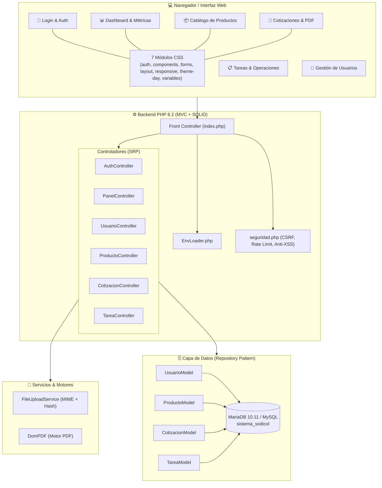

# Plan de Implementación — Sistema Sodicol (v1.3.1)

Este documento describe la planificación técnica, fases de evolución, decisiones de arquitectura y el cronograma de madurez del **Sistema de Gestión Empresarial y Cotizaciones de Sodicol Zomac S.A.S**.

---

## 🎯 Objetivos de Ingeniería

1. **Gestión Empresarial Centralizada:** Unificar catálogo de productos, asignación de tareas operativas y creación de cotizaciones formales en PDF con cálculo automático de IVA.
2. **Arquitectura MVC con Principios SOLID:** Separación estricta de responsabilidades (SRP), contratos de repositorio (`RepositoryInterface`), inversión de dependencias y servicios desacoplados (`FileUploadService`).
3. **Calidad y Resiliencia:** Suite automatizada de 27 pruebas unitarias (PHPUnit 10.5), integración continua con GitHub Actions y control de concurrencia mediante transacciones y bloqueos de tabla (`LOCK TABLES cotizaciones WRITE`).
4. **Seguridad Integral:** 6 capas de seguridad activas (Rate Limiting, CSRF rotativo, sanitización de entrada, Prepared Statements en MySQLi, contraseñas Bcrypt y escape anti-XSS).
5. **Modularidad CSS:** División de la hoja de estilos en 7 módulos independientes bajo `css/modules/`.

---

## 🏗️ Diagrama de Fases y Roadmap

```mermaid
timeline
    title Hoja de Ruta y Madurez del Sistema Sodicol
    section Fase 1 : MVC & Base de Datos
        Modelado de Datos : Tablas usuarios, productos, tareas, cotizaciones, items
        Patrón MVC : Front Controller index.php y separación SRP
        Repository Pattern : Implementación de RepositoryInterface
    section Fase 2 : Docker & Resiliencia
        Docker Compose : PHP 8.2 + Caddy + MariaDB 10.11
        Variables de Entorno : EnvLoader.php para desarrollo y producción
        Despliegue VPS : Script deploy.sh automatizado
    section Fase 3 : Calidad & DevOps (v1.3.1)
        PHPUnit 10.5 : 27 tests unitarios y 33 aserciones
        GitHub Actions : Pipeline CI/CD en PHP 8.2
        Modularización CSS : 7 submódulos bajo css/modules/
        Higiene de Seguridad : 0 credenciales ni datos personales en historial
    section Fase 4 : Operación Continua
        Monitoreo VPS : Auditoría de logs, rate limiting y backups
        Generación de PDF : Motor DomPDF integrado
```

---

## 🏛️ Diagrama de Componentes de la Solución



---

## 📊 Matriz de Trazabilidad y Verificación

| Componente | Requisito Técnico / Negocio | Mecanismo de Verificación |
|------------|-----------------------------|----------------------------|
| Autenticación Segura | Bcrypt con `password_verify()` | `AuthControllerTest::test_login_con_password_valido_autentica_correctamente` |
| Control de CSRF | Tokens rotativos con `hash_equals()` | `SeguridadTest::test_csrf_token_generacion_y_validacion` |
| Rate Limiting | Máximo 15 peticiones/minuto | `SeguridadTest::test_rate_limit_bloquea_exceso_de_peticiones` |
| Integridad de Cotizaciones | Concurrencia con bloqueo exclusivo | `CotizacionModelTest::test_crear_cotizacion_genera_consecutivo_unico` |
| Catálogo de Productos | Validación de dependencias antes de eliminar | `ProductoModelTest::test_verificar_dependencias_de_producto` |
| Suite Automatizada | CI/CD en la nube | GitHub Actions `.github/workflows/ci.yml` (PHP 8.2) |
| Modularidad CSS | Separación de responsabilidades | 7 archivos independientes bajo `css/modules/` |
